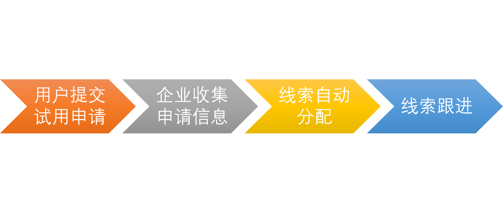
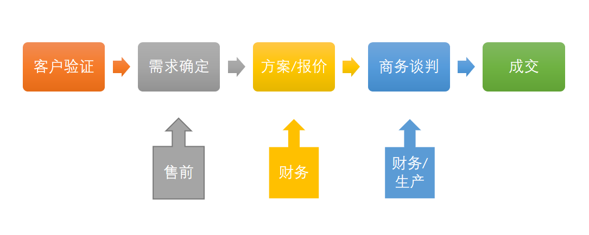

# CRM 有关于 销售、销售总监、老板部分的功能（偏向BI）

## 线索转换分析模块

销售：
1.个人线索转化率/时间折线图
2.记录线索情况

销售总监：
1.不同市场活动，线索的转化率（线索->商机->订单）
2.同个活动线索的不同销售的转换率
3.手动分配线索

老板：
1.总体订单金额/时间折线图

## 客户跟进模块

销售：
1.跟进并记录客户商机情况
2.商机阶段分布

销售总监：
1.商机流程转化时间分析（不同阶段的转化率和转化所需的时间）
2.业绩预测

老板：
1.业绩预测

## 自定义数据分析

销售：
1.直接依据数据制作报表
2.订阅现有报表每日自动更新推送

销售总监：
1.设置报表主题

老板：
1.订阅报表

## IT系统对接

管理员：
1.自定义对象与其他系统特殊对象对接，双向同步数据、业务、流程

例如：对接财务自动生成记账凭证、对接ERP自动转订单为生产单，对接HR自动同步员工信息、内嵌本系统在企业已有平台上免登陆进入

# 问题-疑惑

1.资料全部都是从总体角度分析功能，包括实验账号中并未找到有关于角色预设的设置。可能原因：销售细分工作不同不同公司的角色实际执行部分不同，

2.连接型CRM如下图，是指过程中销售负责整个流程并与售前人员，财务人员，生产人员对接的意思么？

3.wiki提供的两个测试账号均无法查看线索池。

# 阅读资料之前对于BI在销售、销售总监、老板之间发挥的作用预测

销售
1.计算线索成功率，指导销售行动
2.提供报价|成功率预测曲线指导销售制定价格

销售总监
1.不同销售对于低成功率线索的成功率（销售能力）的直观评分
2.对于销售，提高报价能力的直观评分
3.挖掘成功企业的特点和共性，推荐可能满足条件的企业
4.线索量与订单金额的预测曲线

老板
1.销售人员数量与订单总额度预测曲线

其他：类似自定义报表提供模型自定义预测数据趋势。

# 个人观点记录

BI系统主要提供基于数据可视化方面的支持，流程自动化方面有，自动分配线索到销售，数据挖掘方面有，推荐客户。个人认为数据**可视化**对决策的帮助有限且基本都是针对于销售总监和老板的，对于销售本身的帮助不大。类似orcle拥有计算线索成功率并依据此进行排序分配，给与销售工作重点分配指导。saleforce拥有深度学习工具包，能够自动建立带有预测性质的图表（依据以往数据预测下一季度的数据情况）。这种基于以往数据计算得出的预测性质的数据能够结合数据可视化为决策提供更多建议。在orcle和salesforce中，销售大多直接通过crm直接与客户联系，留存了更多销售与客户之间的交互数据，为进一步的数据挖掘提供支持。纷享销客内部拥有完整的企业内任务关系信息，可以以此挖掘，为销售综合业务能力评分。个人认为技术难度较小，且帮助较大的功能为salesforce提供的机器学习预测工具，可以同时提供预测值以及预测值的准确性供决策者参考。由于测试账号有关于线索的操作提示默认布局不存在对于纷享销客的理解还有很大的盲区。

## 补充

因为查找资料时以BI为主轴，未观看SFA的文档得出了BI数据分析对销售本身帮助不大的结论。