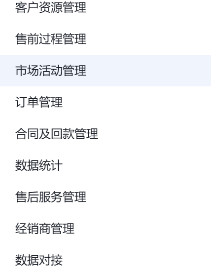
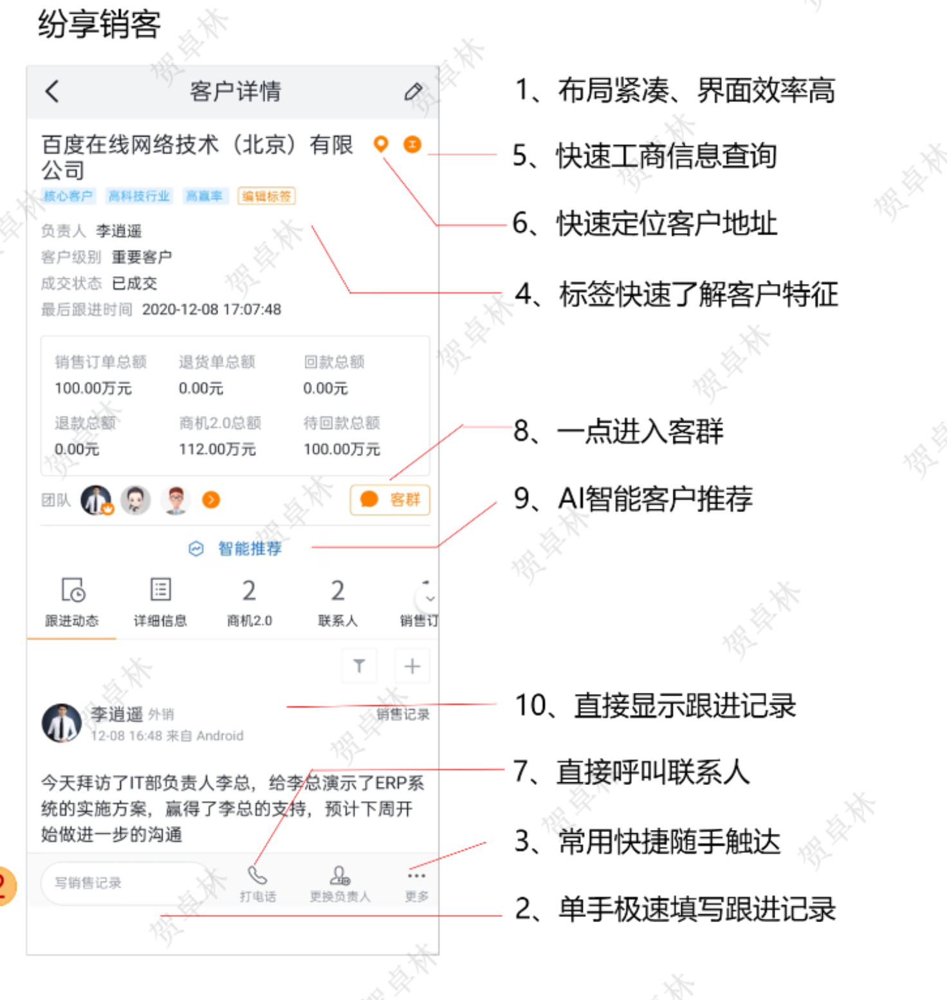
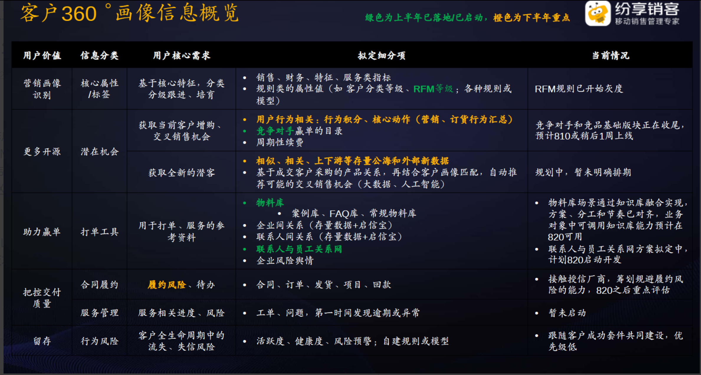

# 线索

## CRM核心需求

预计使用端口数量？？

ai智能客户推荐

公海？//客户

市场活动

销售线索

线索池

客户

联系人

商机

销售

## CRM 与 SFA 的区别

销售业务自动化与 CRM 有什么区别？尽管 CRM 与 SFA 关系密切，现实中经常被互换使用，但两者不能完全等同。具体而言，销售业务自动化软件旨在改善销售，它可以增强产品/服务销售工作，致力于提高整个销售流程的效率。

而 [CRM](https://www.oracle.com/cn/cx/what-is-crm/) 专用于管理客户关系，旨在改善企业与客户之间的整体关系。

### 客户关系管理

CRM 软件旨在用于管理客户关系，但它不是一个单一解决方案。为了有效管理、分析和改善客户关系，您需要一整套的云解决方案来满足您在客户旅程中每一个环节的需求。这种端到端的解决方案套件通常包含一个销售解决方案（涵盖 SFA、[合作伙伴关系管理](https://www.oracle.com/cn/cx/sales/partner-relationship-management/)、[激励和薪酬](https://www.oracle.com/cn/cx/sales/sales-performance-management/)、[销售预测](https://www.oracle.com/cn/cx/sales/sales-planning-forecasting/)）、一个[客户服务解决方案](https://www.oracle.com/cn/cx/service/)、一个[营销自动化解决方案](https://www.oracle.com/cn/cx/marketing/)，以及一个可打通线上、线下和第三方数据源，进而构建完整的动态客户视图的[ AI 增强的客户数据平台 (CDP)](https://www.oracle.com/cn/cx/customer-data-platform/)）。

SFA 售前360度客户画像

   

