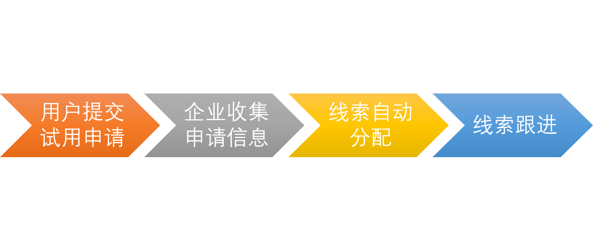

以 销售、销售总监、企业老板三个角色如何利用crm系统做出**数据分析**引导

# 销售

## 自我猜想

1. 计算线索成功率，指导销售行动
2. 提供报价|成功率预测曲线指导销售指定价格

## 纷享现有功能

1.对于线索池的汇总

2.自定义图标分析

3.线索池自动分配销售

4.预置150+图表、30+数据驾驶舱

5.AI智能客户推荐

### 业务流程：

### 销售自动化【重点】

- 客户（公海）/ 财务信息、地址信息 / 客户账户、预存款、返利
  - 公海
    - 实现资源共享，调动员工积极性
  - 分配
    - 推拉式
    - 收回
  - 跟进【弱】
    - 流程
  - 转化
    - 订单
- 联系人
- 商机（销售流程）
  - 销售流程：规范跟进商机过程中的动作（要求和反馈），标准化销售过程，下举例：
    - 验证客户：要求-打电话（话术），反馈-电话记录
    - 确认需求：要求-拜访客户，反馈-拜访记录、客户需求
    - 方案/报价：要求-出方案和报价，反馈-报价单
    - 赢单：生成订单
    - 输单：原因、竞品
    - 无效
  - 销售漏斗：查看各阶段转化率、优化流程
- 报价单
- 合同、销售订单（订单产品）/退货单（退货单产品）/促销
- 回款（回款明细）、回款计划 /退款
- 开票
- 拜访、盘点
- 产品、价目表（价目表明细）

# 销售总监

## 自我猜想

1.不同销售对于低成功率线索的成功率（销售能力）的直观评分

2.对于销售，提高报价能力的直观评分

3.挖掘成功企业的特点和共性，推荐可能满足条件的企业

4.线索量与订单金额的预测曲线

# 企业老板

## 自我猜想

1.销售人员数量与订单总额度预测曲线

