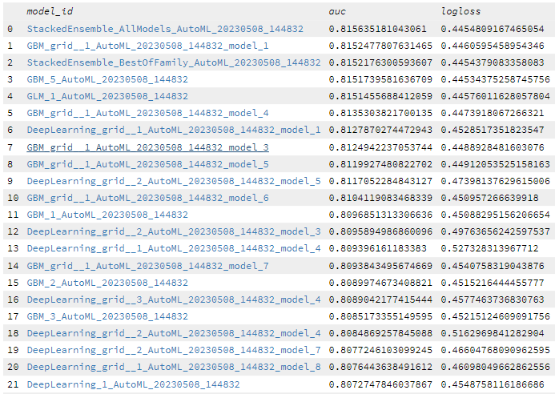
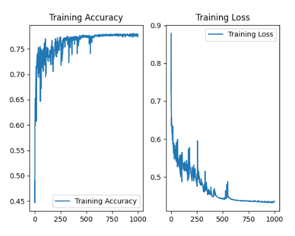
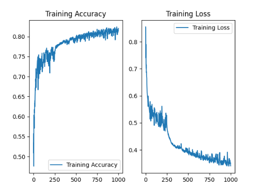

## 场景一：预测客户成单率

数据：人为筛选与成单率相关的变量：企业历史成单信息，与销售的所有互动信息，联系人等。

此场景不符合autoML的全结构化数据预测，因为历史成单信息为表单需要进一步解析为企业方向，预算，偏好等。销售互动信息中也存在跟进流程等非结构化数据，需进一步处理。

因常用性高，可单独设计模型进行预测。

使用saleforce提供的简单测试数据，仅包含：是否成单，机会类型，线索来源，账户金额，产业类型（industry），利用4个数据预测成功率，使用H2O autoML训练（不划分测试集）

---

使用最简单的反向传播网络测试

准确率为77.53%

（经过优化深层网络）

可达到更高。

## 场景二：预测未来6个月份销售量数据

数据：历史月份的销售量、线索量、销售数量（销售能力）

时间序列预测模型，准确度相对低，因为最大因变量市场因素无法预测获取，属于AutoML范畴，可以用Einstein discover建立
