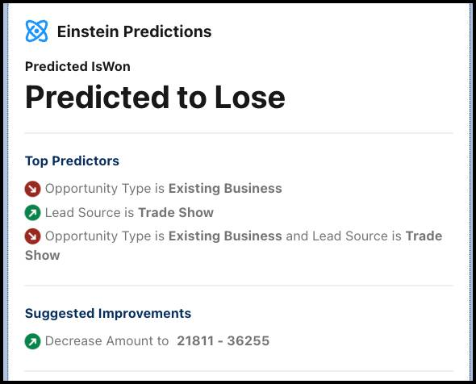

部署模型后，您可以用它在 Lightning Experience 记录页面上检索和显示标准或自定义对象的预测和改进。

1. 在“设置”中的“快速查找”框内输入 `lightning app`，然后单击 **Lightning 应用程序生成器**。
   

   

2. 单击**新建**。
   

   

3. 选择 **Record Page（记录页面）**并单击 **Next（下一步）**。
   

   

4. 系统提示时，输入标签，选择 **Opportunity（业务机会）**对象，然后单击 **Next（下一步）**。
   

   

5. 系统提示时，选择 **Header and Right Sidebar（标题和右侧栏）**模板，然后单击 **Finish（完成）**。
   

   

在 Lightning 应用程序生成器页面，通过添加组件来进行自定义。

从 Lightning 组件窗格中，将这些组件拖到 Lightning 页面画布上。

- 将突出显示面板拖动到标题 (1)
- 将详细信息记录拖动到左侧面板 (2)
- 将 Einstein 预测拖动到右侧面板 (3)

1. 选择 **Einstein Predictions（Einstein 预测）**组件。在 Properties（属性）窗格中，使用 Prediction（预测）查找来找到并选择要用于预测的模型。Lightning 应用程序生成器会自动显示与此 Lightning 记录页面所关联的对象匹配的已部署模型。
   

   选择模型时，请注意 Einstein 预测面板会自动填充。

2. 在本例中，预测值为 6.01，表示预测结果的概率。由于该模型被训练用于预测 IsWon，根据该模型，赢得此业务机会的概率为 6.01%。

3. 在 Properties（属性）窗格中，为 **Positive prediction label（正面预测标签）**指定 `Predicted to Win（预测赢得）`。对于 **Negative prediction label（负面预测标签）**，指定 `Predicted to Lose（预测失去）`。然后单击**保存**。现在您可以看到它是如何运行的：接下来，简化此面板，以便您的用户更容易理解。

   

4. 清除**显示预测标签**并将**标题**更改为 `Predict Win / Loss（预测赢得/失去）`。向下滚动并清除**显示预测因素的值**以及**显示预测警告**。只需单击几下即可简化此面板的外观！

   

5. 单击**保存**。

6. 如果有提示，单击 **Activate（激活）**按钮，单击 **Assign as the org default（分配为组织默认设置）**并接受所有默认设置。
   否则，单击工具栏上的 **Activation（激活）**按钮，单击 **Assign as the org default（分配为组织默认设置）**并在系统提示时接受所有默认设置。

我们来看看您的页面。

1. 单击应用程序生成器标题中的 **Back（返回）**。
2. 从应用程序启动器中找到并选择 **Sales（销售）**，然后单击 **Opportunities（业务机会）**选项卡。
3. 选择任何未处理的业务机会。您可能需要刷新业务机会页面，才会显示您刚刚对记录页面所做的更改。当用户查看此记录页面时，预测会实时更新。每次选择观察时，其预测变量（业务机会类型、潜在客户来源、行业和金额）的值都会作为输入提交给模型，然后将预测和改进作为输出返回并在此处显示。