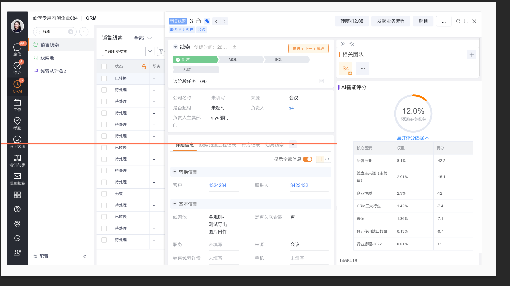

# 线索转换概率（线索评分）

基于历史数据对线索的转换概率进行预测，拥有80%+的准确率，线索信息完整度越高，预测越精准。您可以依据线索转换概率作为跟进的顺序依据，在线索转换概率详情中看到，不同字段对线索概率的影响是正向还是负向让您了解评分的主要影响项。界面如下：

默认情况下评分依据是收起的状态。

目前模型还在优化阶段，会纳入更多维度对线索进行评分，在实际场景中线索在不同阶段的表现无法很好的还原到恰当的时间点，因此在使用中发现存在问题欢迎记录下来帮助我们改善模型。