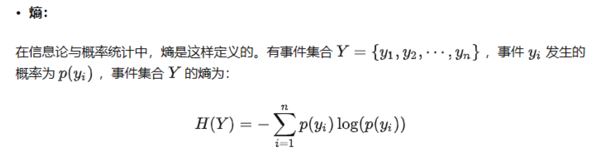
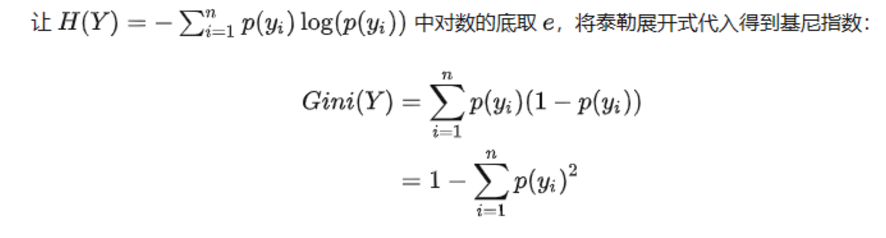

## 模型衡量指标

**loss值**：**衡量预测值与实际值差距的量**，具体模型loss值计算公式可能不同，越小代表模型与实际更加接近，越大代表偏差越大。下面三个均为loss值的具体公式。

**MSE、MAE、RMSE、MAPE**：平均方差、平均绝对值差，平均方跟差、平均绝对百分比误差。这四个指标均为衡量模型loss值的公式，MSE没有直观的能力描述，是综合了抖动大小和偏差率的一个量，**MAE代表模型表现能力准确性**，RMSE是MSE的平方根，一般情况下用来和MAE做比较，若**MAE与RMSE的差距越大则模型浮动越大**（示例：2批零件良品率均为95%，但是第一批不良品中尺寸浮动±5%，第二批不良品中浮动±10%，则第二批浮动大，RMSE与MAE的差即形容浮动程度的量）,MAPE相当于MAE相对于正确值的百分比，由于真实值存在0所以一般不采用。

 **R²**：衡量线性回归中自变量对于因变量的解释程度，也就是**衡量模型因变量总体与预测值的相关度**取值范围[0,1)，自变量越多相关性自然越高，因此为了增加模型变量的有效率，常用R²adjust来形容。

**PSI**：群体稳定性指标，是验证样本集（val_dateset）在各分数段的分布与建模样本（train_dateset）分布的差异。此指标是用来分析**验证样本集是否能代表此类数据**的一个指标。(0,0.1] 好(0.1,0.25] 一般(0.25,+∞) 验证样本集不能代表此类数据。此项数据出现问题一般只因为数据集太小，随机抽出的测试样本集过少（过多也可能但是一般测试集小于训练集不会出现过多的情况）

**TP、TN、FP、FN** ：首字母T和F代表预测结果与样本真实结果是否一致，尾字母P和N分别代表预测的结果为正或者负。

**TP：**True Positive，分类器预测结果为正样本，实际也为正样本，即正样本被正确识别的数量。

**FP：**False Positive，分类器预测结果为正样本，实际为负样本，即**误报**的负样本数量。

**TN：**True Negative，分类器预测结果为负样本，实际为负样本，即负样本被正确识别的数量。

**FN：**False Negative，分类器预测结果为负样本，实际为正样本，即**漏报**的正样本数量。

  **Accuracy**： **准确率**（TP+TN）/样本总数  ； **预测正确的占总样本的比例** 

  **Precision** ：**查准率** TP/(TP+FP) ；**预测正确的正样本占全部预测为正的比例** 

  **Recall**： **召回率** TP/(TP+FN)；**预测正确的正样本占全部正样本的比例** 

**lift**：提升度[TP/(TP+FP)]/[ (TP+FN)/样本总数] ；**查准率占正样本率的比例，用于衡量与不用模型相比，利用模型的提升度**

**Gain**：

## 前言

此部分介绍为传统树形机器学习方法，对于结构化数据以及样本量少的数据集，传统方法的表现会优于深度神经网络，机器学习中有大量的超参数（人工填写的固定值）对于模型的影响较大，根据不同数据调整超参数是主要的任务，因此有autoML自动机器学习算法用来自动调节超参数。（注：树形机器学习方法对于多字段（大于30）提取表现远不如深度神经网络。）

## 决策树

 [微痛学习 决策树 - 知乎 (zhihu.com)](https://zhuanlan.zhihu.com/p/360060513) 

 Classification And Regression Tree (CART)CART决策树为目前最常用的决策树。

 分类树用**基尼指数**选择最优特征(与信息增益类似)，同时决定该特征的最优二值切分点。 

基尼指数： 使用一阶泰勒展开式化简信息熵的公式从而得到的基尼指数。

将泰勒公式-ln(x) ≈ 1-x带入熵的公式

从根节点开始，对每个特征的每个切分点计算基尼指数，选择最小的那个作为最优特征和最优切分点。重复分裂节点，直到节点样本数量太少或者基尼指数太小或者特征不够了才停止。叶子节点上的最终类别是这个叶子节点上样本数量最多的那个。 

## GBM

** [系统梳理 Gradient Boosting Machine - 知乎 (zhihu.com)](https://zhuanlan.zhihu.com/p/361036526) **本文为文章简化改写如有不懂查看原文

 梯度提升机（Gradient Boosting Machine，GBM）是 Boosting 的一种实现方式。  **Boosting 的思想**是：n 个弱学习器 -> 强学习器。它没有限定算法特点，能把弱变强即可，但大多数 Boosting 算法都会螺旋迭代式地训练弱学习器，然后将结果加起来作为最终结果。形象点来说就是这样：  那么什么是 那么什么是弱学习器，什么是强学习器？**弱学习器**就是比随即分类稍好一点，比如随即分类正确率为 50%，错误率为 50%，那么弱学习器正确率就是刚刚超过 50% 一点，比如 55%，而**强学习器**则是正确率很高很高，比如 90%，如下图： 

GBM通过 **缩减（shrinkage）**的方式来形成多个弱学习器。缩减的主要思想是对于第一个弱学习器F(x) 提升拟合效果的方法就是训练一个新的学习器h(x)去学习F(x)与真实值之间的差距，用F(x)+h(x)表示新的预测值。

设F(x)+p* h(x)为新的拟合函数寻找使loss值最小的p，这里的loss是F(x)+p* h(x)与真实值y之间loss函数值。至此完成一次缩减操作。

通过循环N缩减操作最终得到GBM学习器，但实践证明这样的GBM学习器泛化性不好，容易过拟合，因此通常我们需要添加超参数V代表学习率，将一次缩减的函数改为F(x)+v* p* h(x)

### GBM 个人总结

GBM是一种机器学习的优化框架，并未局限弱学习器的算法（一般使用决策树里的cart模型），必须结合其他学习器使用。同时这种算法框架也可以使用深度神经网络作为学习器。主要思想为**Boosting 和shrinkage**

## XGBoost

 [XGBoost 详细讲解 - 知乎 (zhihu.com)](https://zhuanlan.zhihu.com/p/360060567) 

## lightGBM

 [LightGBM 详细讲解 - 知乎 (zhihu.com)](https://zhuanlan.zhihu.com/p/366952043) 

 [LightGBM参数设置，看这篇就够了 - 知乎 (zhihu.com)](https://zhuanlan.zhihu.com/p/376485485) 

## RuleFit

