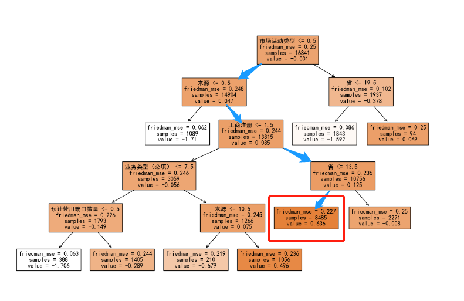
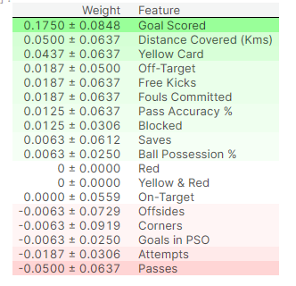
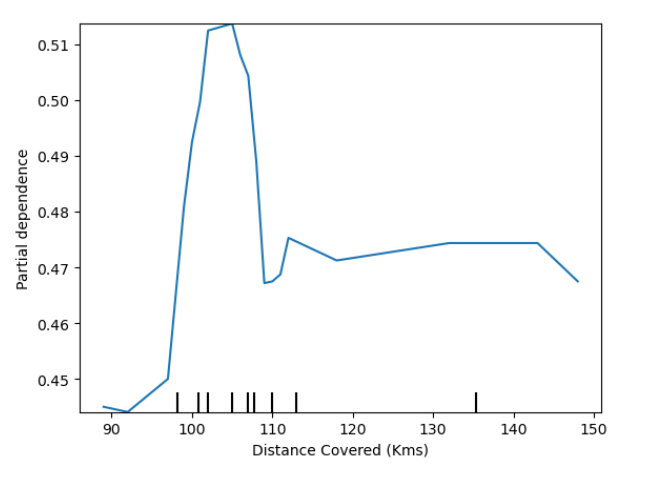

信息空白数         6.0
来源           14.0
预计使用端口数量      0.0
所属行业          0.0
二级行业          0.0
二级行业-2022     0.0
企业规模          0.0
销售团队人数        0.0
市场活动类型        0.0
行为积分差值        0.0
线索等级          2.0
省             0.0
工商注册          2.0
业务类型（必填）     12.0


市场活动类型为空

来源为非空，

工商注册为否

省份为 {上海市', '云南省', '内蒙古自治区', '北京市', '台湾省', '吉林省', '四川省', '天津市', '宁夏回族自治区'}

​     

0.67449464

0.65384573

# kaggle 模型可解释性学习

 [Use Cases for Model Insights | Kaggle](https://www.kaggle.com/code/dansbecker/use-cases-for-model-insights) 


Feature engineering  usually involves repeatedly creating new features using transformations of your raw data or features you have previously created.

 

 One competitor found that the difference between two of the features, specifically`f527 - f528`, created a very powerful new feature. Models including that difference as a feature were far better than models without it. But how might you think of creating this variable when you start with hundreds of variables? 


 If I randomly shuffle a single column of the validation data, leaving the target and all other columns in place, how would that affect the accuracy of predictions in that now-shuffled data 


With this insight, the process is as follows:

1. Get a trained model.

2. Shuffle the values in a single column, make predictions using the resulting dataset. Use these predictions and the true target values to calculate how much the loss function suffered from shuffling. That performance deterioration measures the importance of the variable you just shuffled.

3. Return the data to the original order (undoing the shuffle from step 2). Now repeat step 2 with the next column in the dataset, until you have calculated the importance of each column.

dkls 

```python
import eli5
from eli5.sklearn import PermutationImportance

perm = PermutationImportance(my_model, random_state=1).fit(val_X, val_y)
eli5.show_weights(perm, feature_names = val_X.columns.tolist())
```




 The first number in each row shows how much model performance decreased with a random shuffling 

 The number after the **±** measures how performance varied from one-reshuffling to the next. 


```
disp3 = PartialDependenceDisplay.from_estimator(rf_model, val_X, [feature_to_plot])
plt.show()
```




对应魔数单变量归因

```
fig, ax = plt.subplots(figsize=(8, 6))
f_names = [('Goal Scored', 'Distance Covered (Kms)')]
# Similar to previous PDP plot except we use tuple of features instead of single feature
disp4 = PartialDependenceDisplay.from_estimator(tree_model, val_X, f_names, ax=ax)
plt.show()
```

 

 对应多变量归因


  [Shap](https://github.com/slundberg/shap) 

```
import shap  # package used to calculate Shap values

# Create object that can calculate shap values
explainer = shap.TreeExplainer(my_model)

# Calculate Shap values
shap_values = explainer.shap_values(data_for_prediction)
```

```
shap.initjs()
shap.force_plot(explainer.expected_value[1], shap_values[1], data_for_prediction)
```

- `shap.DeepExplainer` works with Deep Learning models.
- `shap.KernelExplainer` works with all models, though it is slower than other Explainers and it offers an approximation rather than exact Shap values.

```
# use Kernel SHAP to explain test set predictions
k_explainer = shap.KernelExplainer(my_model.predict_proba, train_X)
k_shap_values = k_explainer.shap_values(data_for_prediction)
shap.force_plot(k_explainer.expected_value[1], k_shap_values[1], data_for_prediction)
```

 [Advanced Uses of SHAP Values | Kaggle](https://www.kaggle.com/code/dansbecker/advanced-uses-of-shap-values) 

这一页图感觉没用

 [Binary Classification with a Tabular Pulsar Dataset | Kaggle](https://www.kaggle.com/competitions/playground-series-s3e10/discussion/396345) 