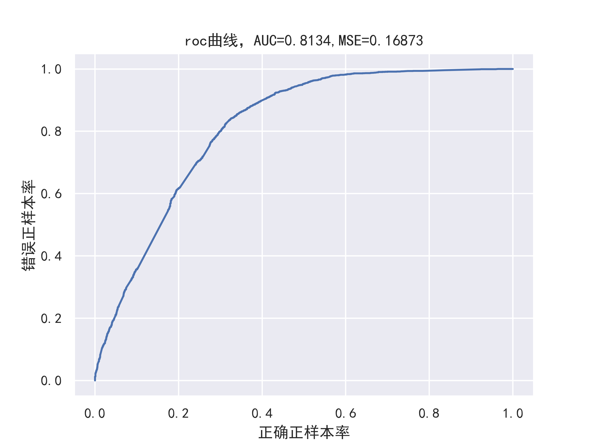
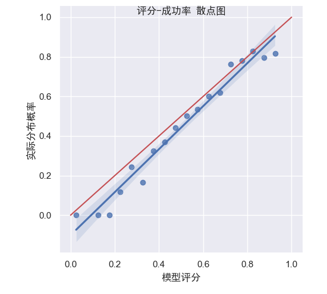
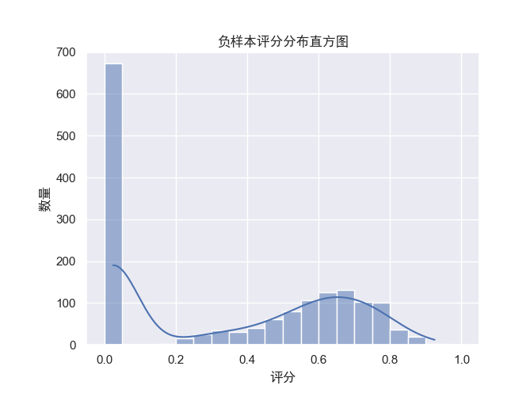
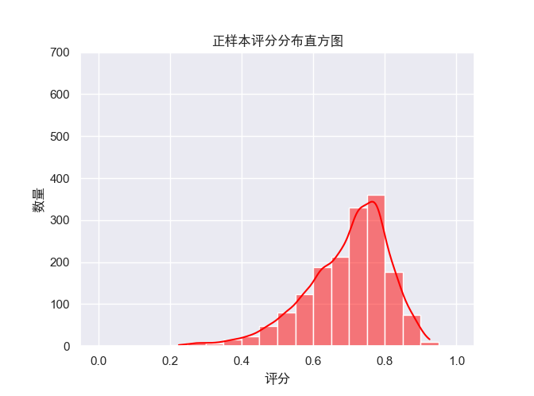
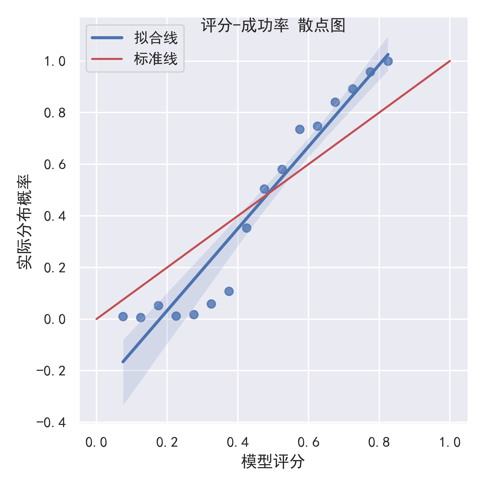
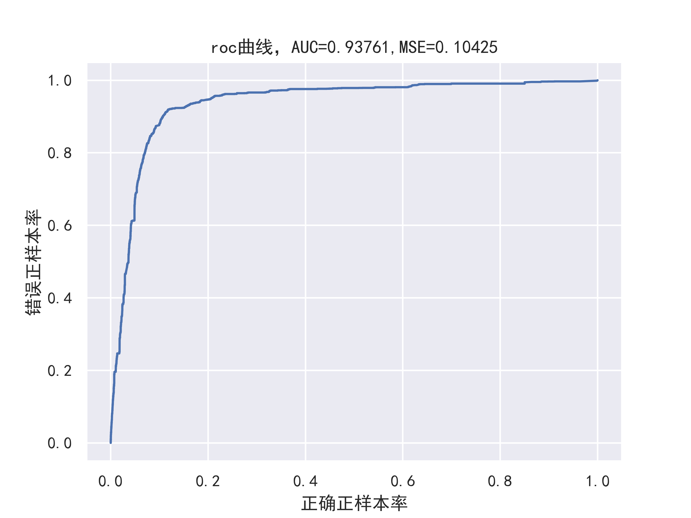
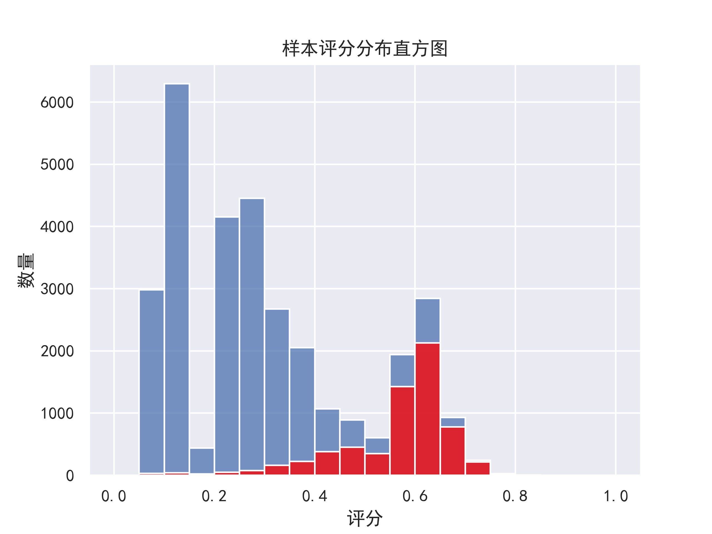

## 


## 标签评判标准

先按照程度分5类标签代表从低到高的成单概率，去测试集中计算此类预测标签的数据成单概率，概率是否单增，概率增长的斜率是否均匀，作为标签好坏的评判标准。

评判程序：C:\Users\17537\Documents\python\Edison\评估模型.py



以AUC和MSE作为统一评判标准

## h2O autoML模型评估

C:\Users\17537\h2oflows\model\StackedEnsemble_BestOfFamily_leads05.11.model

C:\Users\17537\Downloads\StackedEnsemble_BestOfFamily_AutoML_20230511_205642.zip

预测分布：模型在0-1区间内越大表示线索转换率越高








## windows 4模型 2w8数据

C:\Users\17537\Desktop\export\h2o-windows0516

```
# 11982fb57507.csv  新2w8模型 测试集表现
```

MSE为0.171229
划分线为0.349时，召回率0.9239，准确率0.7346
划分线为0.555时，召回率0.8216，准确率0.7508

## Linux 5模型 2w8数据

C:\Users\17537\Desktop\export\h2o-linux0516

```
# d352cce6c585      Linux 全模型
```

MSE为0.168733

## 2021数据表现 （2020模型）

```
# 27320_199_20230529175050   2021新数据-数魔GBM模型（去除职务）
# 27321_146_20230529182722   2021新数据-删除新数据没有的字段重新训练-数魔GBM
# 27322_160_20230529191455   2021新数据-删除新数据没有的字段重新训练-数魔DART
```

详见文件夹，此处列举最后一个模型的表现








## 自建xgb dart模型

```python
model = xgb.XGBClassifier(learning_rate = 0.1,n_estimators= 200,max_depth=12,min_child_weight=0.2,subsample= 0.8,colsample_bytree=0.8,colsample_bylevel=0.8,colsample_bynode=0.8,booster='dart',eval_metric = ["auc"],rate_drop= 0.1,         skip_drop= 0.5,n_jobs=0)
```

auc = 0.8098297356655982  mse= 0.1904168151050944
t-auc = 0.8270055242556855  t-mse= 0.1742421993290384

```python
model = xgb.XGBClassifier(learning_rate = 0.1,n_estimators= 200,max_depth=5,min_child_weight=0.8,subsample= 0.8,colsample_bytree=0.8,colsample_bylevel=0.8,colsample_bynode=0.8,booster='dart',eval_metric = ["auc"],rate_drop= 0.2,skip_drop= 0.5,n_jobs=0)
```

v-auc = 0.9361349063906873  v-mse= 0.09606747600336334

```python
model = xgb.XGBClassifier(learning_rate = 0.1,n_estimators= 200,max_depth=5,min_child_weight=0.5,subsample= 0.4,colsample_bytree=0.4,colsample_bylevel=1,colsample_bynode=1,booster='dart',eval_metric = ["auc"],rate_drop= 0.2,         skip_drop= 0.5,n_jobs=0)
```

auc = 0.7972628954545773  mse= 0.1776743534280504
t-auc = 0.8078150355248903  t-mse= 0.17277785112610514
v-auc = 0.941725547040536  v-mse= 0.09375560754467602

```python
model = GradientBoostingClassifier(n_estimators=200,learning_rate=0.05,max_depth=5,min_samples_leaf=5,subsample=0.8,verbose=1,max_leaf_nodes=10,max_features=None,random_state=2)
```

auc = 0.7942036703338692  mse= 0.1785720820152633  拟合曲线偏差度: 0.03007728540566959  正偏差度: 0.027218538025492702  负偏差度： 0.03265015804782879  recall: 0.8528028933092224  f1: 0.7631067961165048   GBM2020test
auc = 0.8037302154426681  mse= 0.17449893353396087  拟合曲线偏差度: 0.036953368284927735  正偏差度: 0.034028569837726334  负偏差度： 0.039585686887409  recall: 0.8624672863459977  f1: 0.7670760093105387   GBM2020train
auc = 0.9347305430822543  mse= 0.09148577346014138  拟合曲线偏差度: 0.13570694950051757  正偏差度: 0.12171029101461346  负偏差度： 0.14970360798642166  recall: 0.8489049944855838  f1: 0.7878344787249598   GBM2021

GBM_1

```
model = GradientBoostingClassifier(n_estimators=200,learning_rate=0.05,max_depth=5,min_samples_leaf=5,subsample=0.8,verbose=1,max_leaf_nodes=10,max_features=None,random_state=2)
```


```
model = GradientBoostingClassifier(n_estimators=200,learning_rate=0.05,max_depth=5,min_samples_leaf=3,subsample=0.8,verbose=1,max_leaf_nodes=10,max_features=None,random_state=2)
```


```
model = GradientBoostingClassifier(n_estimators=200,learning_rate=0.05,max_depth=5,min_samples_leaf=7,subsample=0.8,verbose=1,max_leaf_nodes=10,max_features=None,random_state=2)
```


