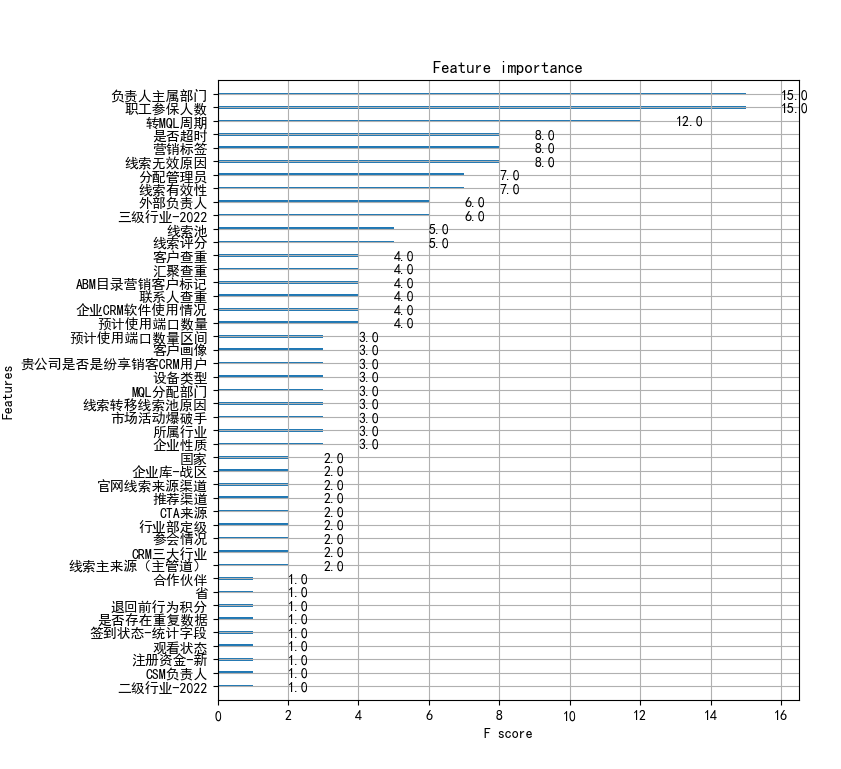
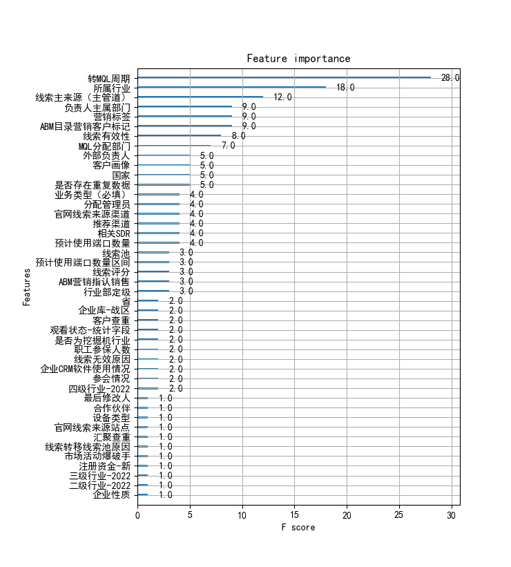
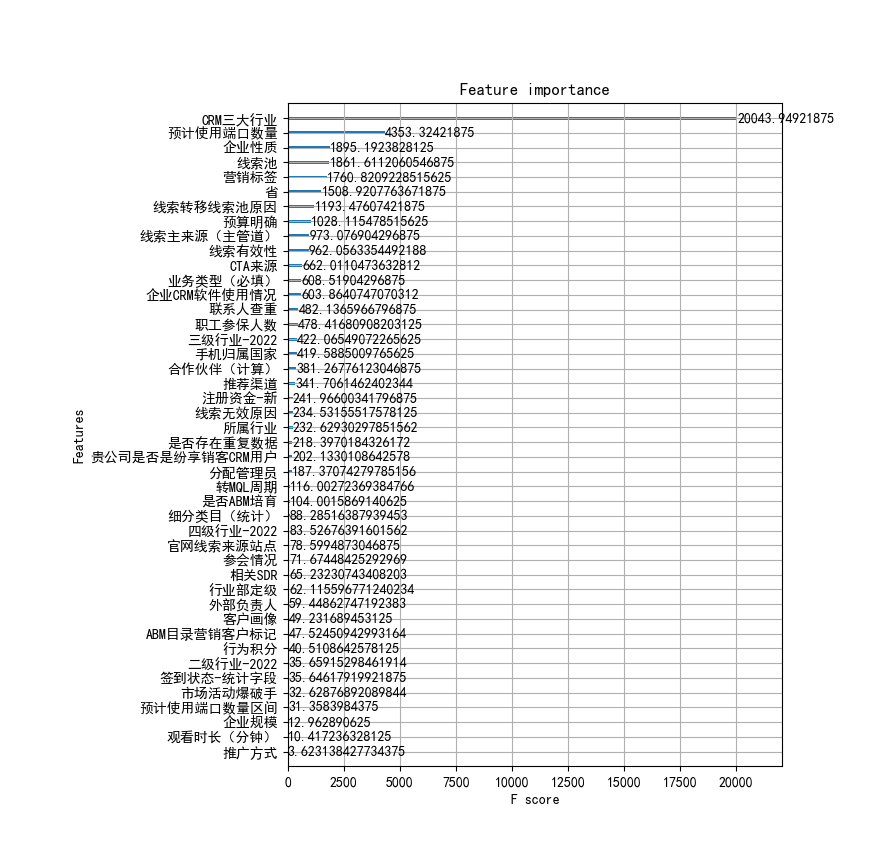
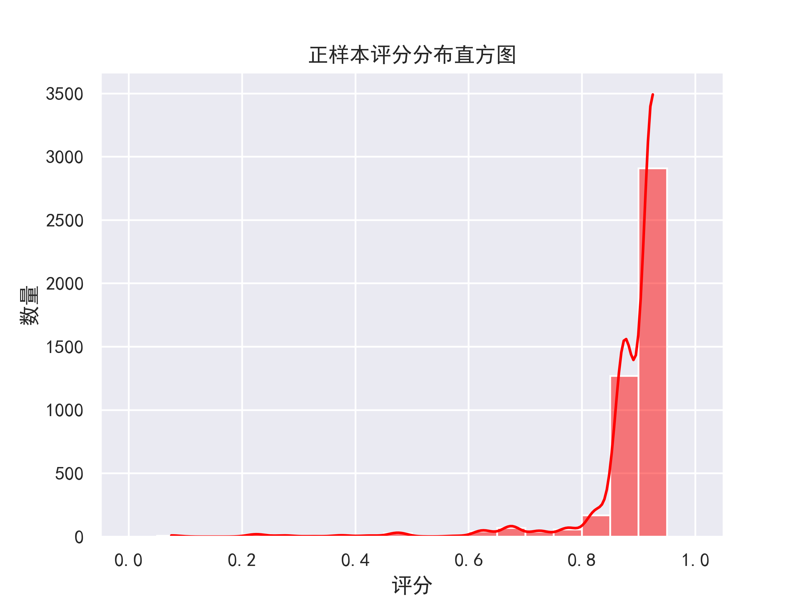
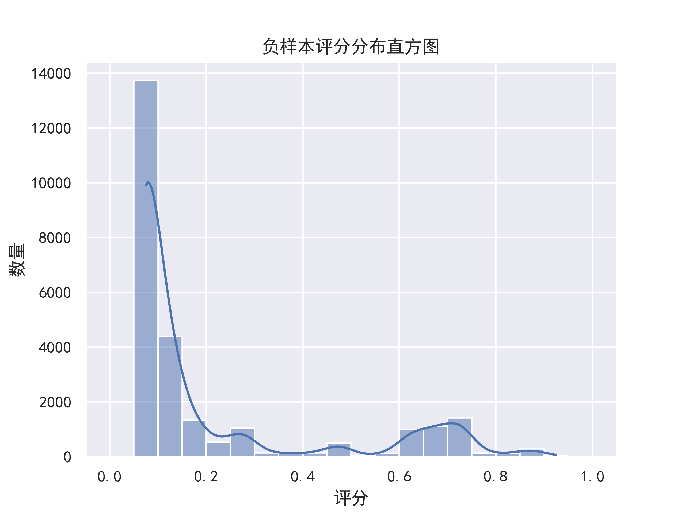
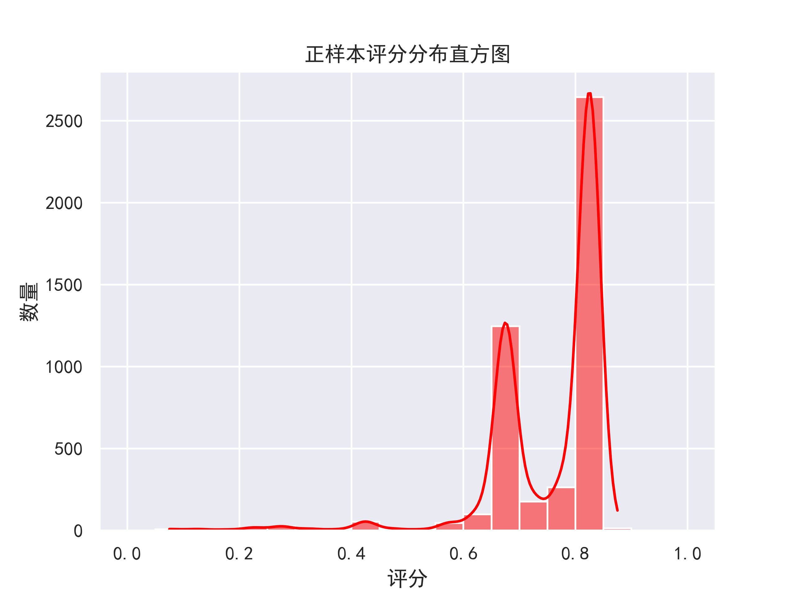
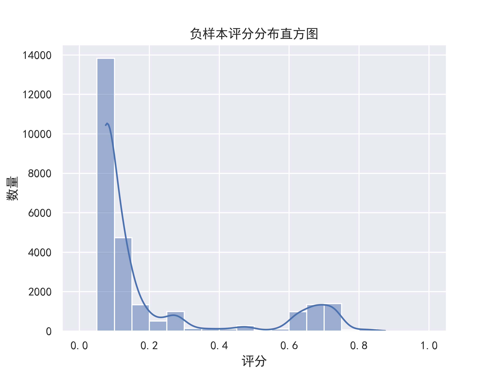

注释： 字段，特征，变量，这三者都是是指输入模型的参数，编写时未注意统一说法。

# 1 特征筛选

## 1.1 去除100%不可用特征

### 1.1.1 根据类别字段是否过于细分的类别去除

此部分暂时采用魔数智擎的方案，计算偏离值（魔数自己起的名字搜索不到）

偏离值计算公式：

loss=log(变量非空数量)/log(2)/(变量类别数-1)     偏离度=0  if loss>1 else (1-loss)

参考[目标特征与所有特征的线性相关表.csv](./目标特征与所有特征的线性相关表.csv)

可以发现界限并不明显，不好划分必定去除的界限。为防止误删暂定0.98为分界线**因此存疑，需要另寻符合需求的算法，或者需要在类别编码时，将数量少的类别进行一些融合。**

### 1.1.2 根据特征完整度进行去除

参考[目标特征与所有特征的线性相关表.csv](./目标特征与所有特征的线性相关表.csv) 

界限同样难以划分，因此应当暂时定界限为0.001，因为要删除的是信息含量低的，一般情况下在模型重要度计算时能删除有关特征。

### 1.1.3 根据是否强相关去除

对比线性相关算法

| 分析方法 | 数据类型                           | 数据分布 | 数据间的关系 |
| -------- | ---------------------------------- | -------- | ------------ |
| pearson  | 数值和数值                         | 正态分布 | 线性         |
| spearman | 数值和数值；数值和分类；分类和分类 | 不做要求 | 不做要求     |
| kendall  | 数值和数值；数值和分类；分类和分类 | 不作要求 | 不做要求     |

*pearson算法的数据对分类类型进行编码

锁定状态、线索阶段、转换周期，三个与状态强相关字段，（需要删除的字段还有，是否超时）

实验结果[目标特征与所有特征的线性相关表.csv](./目标特征与所有特征的线性相关表.csv)

| 分析方法 | 实际表现                                                     |
| -------- | ------------------------------------------------------------ |
| pearson  | 排名靠前的几个值均不为强相关字段                             |
| spearman | 大于80%的值包含全部三个强相关，且分界线较为明显，但是也包含（线索类别）高度空缺会导致相关度变高 |
| kendall  | 与spearman类似分界线同样为80%，计算开销更大                  |
| 自编写LC | 大于99%，一定是包含目标信息的字段，分界线不会有误分情况      |

综合结论，因为字段中含有大量的空缺特征，因此无法划分分界线保障结果，因此针对空缺信息提取的线性相关算法，简称LC，linear_categorical，此算法得出的是特征与目标特征的信息是否为包含关系，（例如唯一id一定包含其他所有信息即可以通过唯一id去确定市场类型的值）因为LC算法的分界线为99%误分类几率小因此选用自编算法

### 1.1.4 去除日期类型变量

因为日期类型变量不应当作为线索评分的参考，未来如果有公司近况舆论分析模块，才考虑使用日期作为输入变量。

### 1.1.5 去除含人名信息的变量

外部负责人

此类数据有可能会让模型效果更好，但是评分系统应当作为线索本身的描述而非销售的因素，一般情况下人名信息为联系人or分配销售信息这部分应当去除单独考虑，高成交率联系人不需要系统帮助销售记录。

### 1.1.6 去除（初步试训模型）贡献值为0的特征

特征的贡献值是由树模型分叉的算法信息熵（简化为基尼指数）计算而来，一些超参数的剪枝会使得贡献变小，因此初步试训模型时强化学习能力，不考虑过拟合的情况下得出贡献值为0的特征，对于剪枝后的模型一定无用，

注：此处参考基础知识介绍中cart决策树的介绍，剪枝是为了增加模型泛化性。

### 1.1.7 去除同含义变量

存在同含义变量但是，细分程度不同，例如一级产业二级产业，需人工判断去除

### 1.1.8 识别特征启用时间，去除中途新建特征

训练集选用1-7月的数据，但是存在一个字段4月份才开始使用（一直存在），应当去除保证空缺值有含义，或进行特殊编码也可。

### 1.1.9 全局刷新改变的计算字段（去除干扰项特征）

由于业务逻辑改变或销售填写规则不统一，存在一些加入反而会使效果变差的特征，例如

注册资金-新  在202207-12训2023测模型中加入此字段会使得模型效果变差（在部分值缺失的情况下）

若模型训练数据后，由于评分规则发生变化（如线索等级这个字段），导致模型性能下降

## 1.2 提供特征去除推荐

1.1.7和1.1.8是否应当让客户选择是否删除

参考、线性相关度、完整度（空缺度）、偏离值、模型贡献值。

## 1.3 人为剔除无关特征

给出说明文档如：删除信息填写在线索转化之后的字段。

## 1.4 特征融合

## 1.5 试验结果

### 去除特征试验结果：

# 2 类别特征编码

## 2.1 简单连续正整数编码

分配管理员 系统、空白、其他  注：目前模型编码存在问题？？？没有系统

## 2.2 融合语义的特征编码

# 3 超参数优化

## 3.1 网格搜索

## 3.2 贝叶斯搜索

# 4 其他

## 4.1 模型是否可用评判

### 4.1.1 模型单一特征泛化性

检测模型在线索完整度不同阶段的可靠性，观察特征空缺是否严重影响模型

计算公式1 = 统计特征非空的测试样例分值平均值与置为空之后平均值之差

计算公式2 =模型整体评分之差

计算公式1展示了这个特征能够提供的信息多少

计算公式2展示联系这个特征缺失对于整体数据的影响

2022年自动筛选特征程序训练的模型在2023年的表现

删除 “负责人主属部门” 特征

### 4.1.2 必填字段模型效果-对比完善信息模型效果

将测试数据非必填字段赋值为空后，对比模型效果为模型最差情况下的分类效果，

## 4.2 训练集、测试集划分方法

## 数据量对于上述过程的影响

# 5 实验记录

fs选定的字段 

['企业性质', '来源', '线索主来源（主管道）', '预计使用端口数量', '所属行业', 'CRM三大行业', '二级行业-2022',
       '三级行业-2022', '四级行业-2022', '行业旅程-2022', '企业规模', '营销活动', '参保人数', '参会情况',
       '市场活动类型', 'CSM负责人', 'ABM营销指认销售', '注册资金-新', '相关SDR', 'CTA来源', '线索无效原因',
       '市场活动爆破手', '联系人查重', '落地页名称', '回放状态-统计字段', '线索转移线索池原因', '细分类目（统计）',
       '推广计划', '手机归属省', '转MQL周期', 'ABM目录营销客户标记', '职工参保人数', '汇聚查重', '观看状态',
       '推荐渠道', '是否为挖掘机行业', '回放时长（分钟）', '观看状态-统计字段', '营销标签', '签到状态-统计字段',
       '是否ABM培育', 'MQL分配部门', '官网线索来源站点', '是否存在重复数据', '预算明确', '设备类型', '推广单元',
       '手机归属国家', '官网线索来源渠道', '签到状态', '退回前行为积分', '客户查重', '观看时长（分钟）', '归属部门',
       '企业库-战区', '线索有效性', '贵公司是否是纷享销客CRM用户', '行为积分', '回放状态', '推广方式', '国家', '省',
       '客户画像', '细分类目', '工商注册', '预计使用端口数量区间', '负责人主属部门', '合作伙伴', '线索池', '分配管理员',
       '最后修改人', '业务类型（必填）']