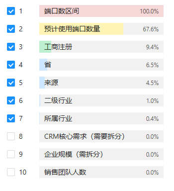

## 意向标签相关字段

线索区字段：

1.企业性质 2.职务 3.来源 4.所属行业  5.企业规模 6.所属地区（通过电话等相关数据获取）7.是否为关键联系人 8.信息完善度

公司工商信息字段：

1.注册资本 2.参保人数 3.招投标信息（需进一步分析）4.成立时间

营销部可获取的字段：

1.销售记录跟进频次2.销售记录跟进时间距今时长3.销售记录内容总字数/平均字数 4.线索轮数

进阶分析字段：

1.企业近期合同分析->回款周期，资金储备 （企业画像？）

2.联系人 关键性分析（难度过高暂不考虑）

特殊字段：

1.销售线索详情，（需解析，需要检测意向的线索基本为空）

2.CRM相关行业，（不同企业字段不同，不具有通用性）

## 初期计划

1.整理获取线索区的数据

2.询问业务人员补充可能的相关字段

1.打分的背景：业务价值

2.思路：落地实现的思路

3.根据思路需求的数据：1.业务的数量输入 2.场景 3. 字段数据

## 初步结论

需对CRM核心要求进一步拆分、企业规模拆分，模型初步表现准确率只有80%不到，神经网络过拟合严重测试集表现仅有73%，初步断定数据筛选存在问题。发现，提供的数据经过空白行删除，破坏了原有的数据结构。