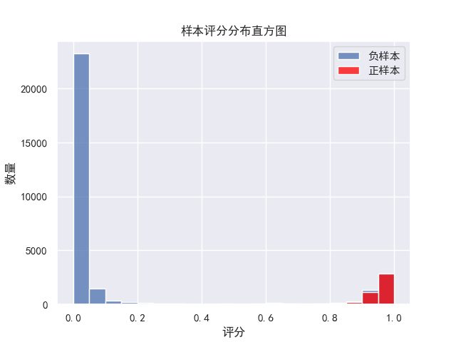
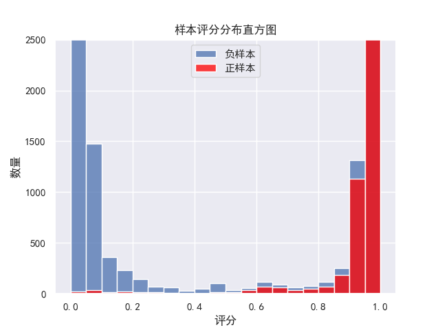
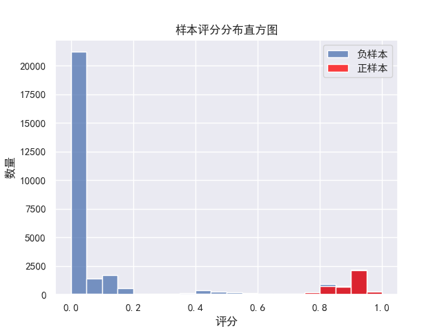
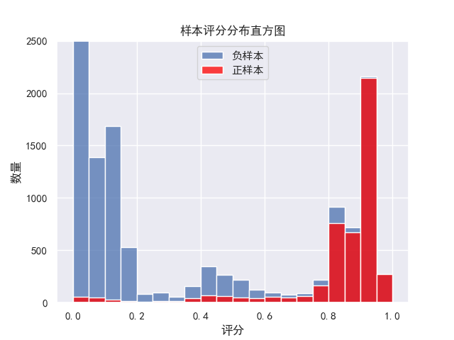

| 版本   | 修改时间 | 备注                                                         |
| ------ | -------- | ------------------------------------------------------------ |
| v0.0.1 | 5月31日  | 初步调研魔数后，用AUTOML搭建的多模型融合                     |
| v0.0.2 | 6月15日  | 因多模型融合表现差距不大改用单模型效果最好的xgboost          |
| v0.0.3 | 6月31日  | 编写自动筛选特征的算法，以及自动优化模型超参数，全流程自动化 |
| v0.0.4 | 7月13日  | 发现线索评分实际场景与训练不同需要做日志恢复进行训练。       |
| v1.0.0 | 7月23日  | 上线版本，优化算法单次计算时间                               |

# 简述

v0.0.1：初步尝试魔数的GBM 、XGBoost、Dart等模型，以及AutoML的GBM，RF，XGBoost，以及融合模型。建立一套评判模型好坏的评分体系。由于当时并未找到魔数融合多个模型的方法，而H2OAutoML可以一键训练模型不用单独训练每个模型再去融合，且表现优于魔数智擎平台。

v0.0.2：提出可解释的需求，因此提供了多种可解释方案,最终选定了shap value作为解释方案，但是可解释的前提是必须选用单模型因此进行重新评估，此时已经在本地建立多个模型并进行尝试，暂未编写自动优化超参数的程序因此还未得出结论。

v0.0.3：编写完自动优化超参数以及筛选特征后尝试不同模型有GBM，XGBoost，lightGBM，RF等模型，发现XGBoost的表现最优。通过切分训练集验证最小训练数据量对于模型表现，发现XGBoost可以在训练样本极低的情况下获得相对不错的表现。

V0.0.4：发现实际业务中提供的数据与训练样本不一致需要做日志恢复，模拟使用模型的场景进行训练，做上线前的工程化搭建。

v1.0.0：提前加载python，优化计算时间，解决java和python之间的编码问题，修改可能存在的字典转换bug。

# 1 特征筛选

## 1.1 去除100%不可用特征

### 1.1.1 根据类别字段是否过于细分的类别去除

此部分暂时采用魔数智擎的方案，计算偏离值（魔数自己起的名字搜索不到）

偏离值计算公式：

loss=log(变量非空数量)/log(2)/(变量类别数-1)     偏离度=0  if loss>1 else (1-loss)

参考[目标特征与所有特征的线性相关表.csv](./目标特征与所有特征的线性相关表.csv)

可以发现界限并不明显，不好划分必定去除的界限。为防止误删暂定0.98为分界线**因此存疑，需要另寻符合需求的算法，或者需要在类别编码时，将数量少的类别进行一些融合。**

### 1.1.2 根据特征完整度进行去除

参考[目标特征与所有特征的线性相关表.csv](./目标特征与所有特征的线性相关表.csv) 

界限同样难以划分，因此应当暂时定界限为0.001，因为要删除的是信息含量低的，一般情况下在模型重要度计算时能删除有关特征。

### ~~1.1.3 根据是否强相关去除（-v0.0.3）~~

删除原因：v0.0.4进行的日志恢复数据选取时间节点在已转换之前因此不存在提前剧透的变量，如果需要加入一部分转换之后填写的信息进行训练则需要重新删除此部分

对比线性相关算法

| 分析方法 | 数据类型                           | 数据分布 | 数据间的关系 |
| -------- | ---------------------------------- | -------- | ------------ |
| pearson  | 数值和数值                         | 正态分布 | 线性         |
| spearman | 数值和数值；数值和分类；分类和分类 | 不做要求 | 不做要求     |
| kendall  | 数值和数值；数值和分类；分类和分类 | 不作要求 | 不做要求     |

*pearson算法的数据对分类类型进行编码

锁定状态、线索阶段、转换周期，三个与状态强相关字段，

实验结果[目标特征与所有特征的线性相关表.csv](./目标特征与所有特征的线性相关表.csv)

| 分析方法 | 实际表现                                                     |
| -------- | ------------------------------------------------------------ |
| pearson  | 排名靠前的几个值均不为强相关字段                             |
| spearman | 大于80%的值包含全部三个强相关，且分界线较为明显，但是也包含（线索类别）高度空缺会导致相关度变高 |
| kendall  | 与spearman类似分界线同样为80%，计算开销更大                  |
| 自编写LC | 大于99%，一定是包含目标信息的字段，分界线不会有误分情况      |

综合结论，因为字段中含有大量的空缺特征，因此无法划分分界线保障结果，因此针对空缺信息提取的线性相关算法，简称LC，linear_categorical，此算法得出的是特征与目标特征的信息是否为包含关系，（例如唯一id一定包含其他所有信息即可以通过唯一id去确定市场类型的值）因为LC算法的分界线为99%误分类几率小因此选用自编算法

### 1.1.4 去除日期类型变量

因为日期类型变量不应当作为线索评分的参考，暂时无法自动利用日期信息

### 1.1.5 去除含人名信息的变量

外部负责人

此类数据有可能会让模型效果更好，但是评分系统应当作为线索本身的描述而非销售的因素，一般情况下人名信息为联系人or分配销售信息这部分应当去除单独考虑，高成交率联系人不需要系统帮助销售记录。

### 1.1.6 去除（初步试训模型）贡献值为0的特征

选取训练模型参数为 决策树数量=200，每次随机选取30%的特征进行计算。

贡献值为0证明这200棵树中没有一个节点选择使用这个特征，即这个特征相较于任意随机抽取的30%特征都不具备任何信息，对训练毫无帮助

由于业务逻辑改变或销售填写规则不统一，存在一些加入反而会使效果变差的特征，例如

注册资金-新  在202207-12训2023测模型中加入此字段会使得模型效果变差（在部分值缺失的情况下）

若模型训练数据后，由于评分规则发生变化（如线索等级这个字段），导致模型性能下降

### ~~1.1.7 去除数据库中后填写的变量 （-v0.0.3）~~

此部分目前还未测试，同空缺性实验证明了假设存在少量的后填写变量，模型依旧拥有分类能力，例如原先评分90%，空缺后评分70%，但仍然能分离低价值线索和已转换线索。

模型本身的分布

final_score= 0.9660319834 auc= 0.9949506758  mse= 0.0181780947  拟合曲线偏差度:0.0320763016  正偏差度:0.0453396684  负偏差度:0.0295285071  recall:0.9641700842  f1:0.9326652051   xgboost-dartval

人为将10个字段置为空之后的分布

final_score= 0.9466438680 auc= 0.9875567263  mse= 0.0253130310  拟合曲线偏差度:0.0415895615  正偏差度:0.0620059390  负偏差度:0.0377271318  recall:0.9227282538  f1:0.8984867591   xgboost-dartval

### 1.1.8 进行日志恢复到实际预测使用的场景(+v0.0.4)

暂时仅仅使用日志恢复到新建时的数据作为训练集，从逻辑上应当增加不同阶段的样本。

例如此部分包括由官网填写表单自动新建的线索（信息完整度几乎为0）和直接导入就是已转换MQL的导入线索，此时缺失了被人为删除的未导入未转化MQL的线索，因此模型缺乏相关线索的判别能力。

等等根据使用场景不同会有各种未考虑的场景，因此希望上线后想办法整理统计一下相关的场景。

## 1.2 提供特征去除推荐，人为剔除无关特征(暂未落地)

### 1.2.1 去除同含义变量

存在同含义变量但是，细分程度不同，例如一级产业二级产业，需人工判断去除

### 1.2.2 产生变换的变量

例1：训练集选用1-7月的数据，但是存在一个字段4月份才开始使用（一直存在），应当调整训练集日期范围，或删除该字段。

例2：字段a与字段同义，在6月之前使用a字段，6月之后使用b字段。提供训练模型是合并字段并人为选择使用模型时输入字段名称。

### 1.2.3 提供空缺度等数据信息人为去除

参考、线性相关度、完整度（空缺度）、偏离值、模型贡献值

## 1.3 特征融合

注：以2022年数据作为训练集，2023年作为测试集，特征工程算法均无明显效果（注：因为模型分类表现已经很好了）

以2020年数据作为训练集，添加信息空白数，能使结果显著提升（使用的特征数量过少）

# 2 类别特征编码

## 2.1 目前选取编码

按照类别数量从高到低排序，依次编码

为的是让数量高的类别直接不要夹杂数量低的导致信息熵变换不明显从而未被区分

可选独热码，哑编码（这两类都会扩展输入模型的特征，在决策树建树时选择的随机挑选特征，以及一棵树中最大交互特征数等超参数会失效，丧失实际意义，实验的表现并不好因此未选用）

为空置为0，编码从1开始。

## 2.2  改进空间

使用词向量，使得语义相近的编码相近（意义不大，目前模型效果已够高）

# 3 超参数优化

## 3.1模型评判体系

 auc， mse，拟合曲线偏差度，recall， f1这5个指标的均值作为最终评判标准。 参考 [AI1.0 基础知识介绍 - 研发管理 - 纷享wiki (firstshare.cn)](https://wiki.firstshare.cn/pages/viewpage.action?pageId=240518380) ，拟合曲线偏差度为自定义的指标，衡量模型预测的转换概率与实际表现的转换概率之间的差距。越大偏差度越高。

## 3.2 网格搜索

## 3.3 贝叶斯搜索（+v0.0.3）

经过测试，上两种时间差距不明显，需要多家数据进行测试，目前已完成相关代码等待测试

注：由于模型特征数量高需要随机抽取部分特征建立决策树，因此随机种子对结果的影响也很大超过超参数的影响，给超参数优化提供了一定的迷惑性。

# 4 模型选取

## 4.1 树模型+shap value可解释

### 4.1.1 XGBoost（目前选用）

单模型表现最佳，计算量略大于其他模型。配合DART提高模型泛化性。其余模型对比参考 [6.15 进度报告 - 研发管理 - 纷享wiki (firstshare.cn)](https://wiki.firstshare.cn/pages/viewpage.action?pageId=240524499) 

### 4.1.2 可解释性

方案参考上述链接，v1.0.0为不增加前端工作量，选用以表格的方式展示shap value及其占比。后续可换为图表。

# 5 工程化问题

 [技术文档 - 研发管理 - 纷享wiki (firstshare.cn)](https://wiki.firstshare.cn/pages/viewpage.action?pageId=248580079) 

