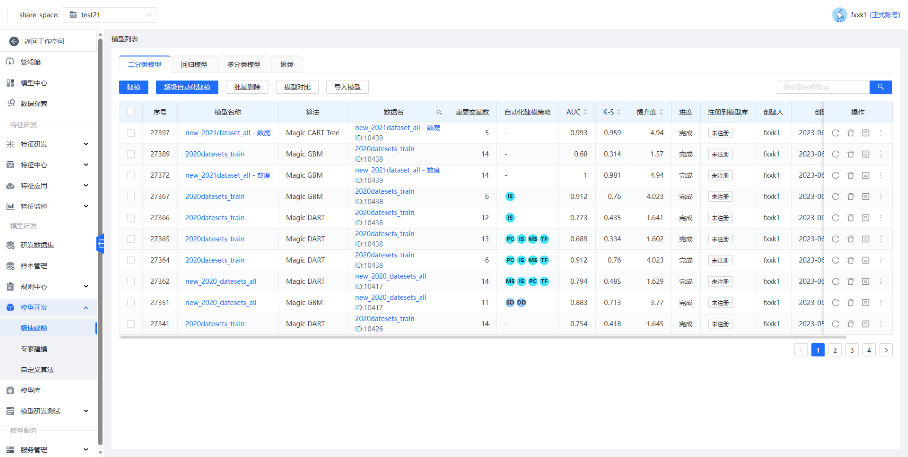
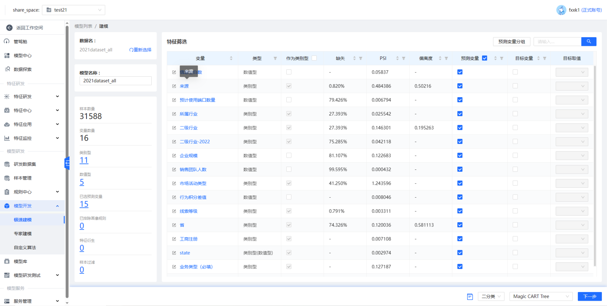

## 模型快速搭建

### 二分类模型

#### 建模

下面只写了参考文档里没有的算法

##### X DeepFM

##### DeepFM

##### SVM

##### lightGBM

##### MODELFUSION_STACKING

##### AutoML

#### 超级自动化建模

#### 模型对比

### 回归模型

### 多分类模型

### 聚类

问题

介绍一下特征研发的功能有哪些么

特征研发里的特征模型是什么，我尝试新建失败了

